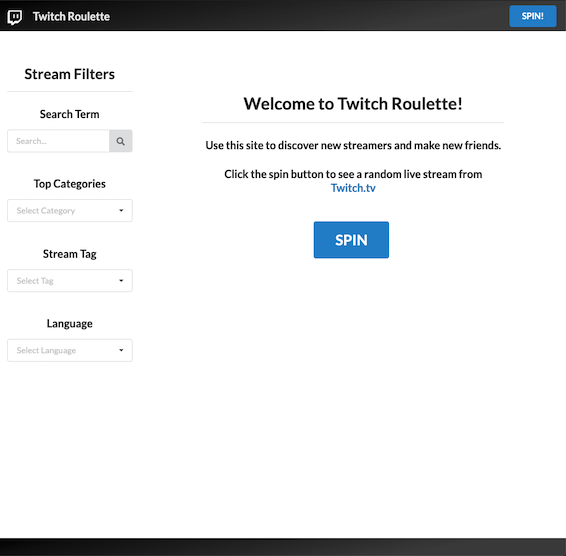
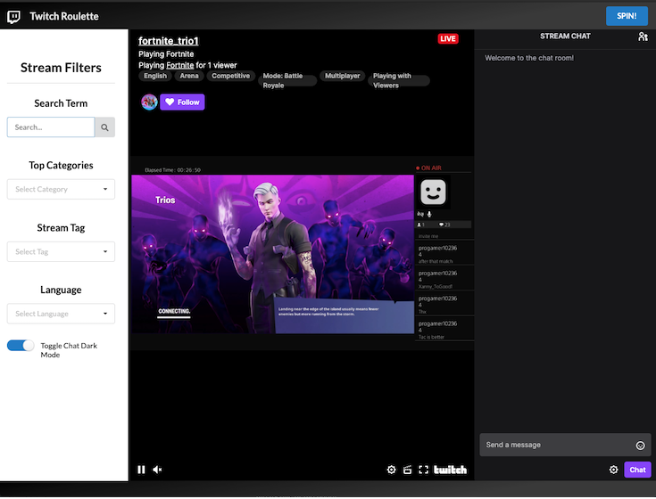

# Twitch Roulette
## Discover new streamers and make new friends!

### Technologies Used
* HTML5/CSS3/Javascript (ES6+)
* jQuery
* Semantic-UI Framework
* Postman API client
* Google Lighthouse audits
* Web Storage API
* Twitch.tv REST API 

| Method | Entity | URL |
|---|---|---|
|POST| Auth Token | https://id.twitch.tv/oauth2/token |
|GET| Tags  | https://api.twitch.tv/helix/tags/streams |
|GET| Games | https://api.twitch.tv/helix/games/top |
|GET| Streams | https://api.twitch.tv/helix/streams  |
|GET| Categories | https://api.twitch.tv/helix/search/categories |

### Installation Instructions
1. Fork and Clone, or download repository
2. Add your own Twitch client id and client secret values in `app.js`
3. Open `index.html`
or
* Visit the following URL in your browser: aarongoldsmith1.github.io

### Unsolved problems / major hurdles that were overcome

* The Twitch.tv API endpoint for live streams only returns a maximum of 100 results per query.  The responses are paginated so in order to get more than 100 results, sequential requests must be made to the same endpoint with an updated value for a paginated cursor.  In order to get more than 100 results from which to select a random stream, I was able to use recursion to solve this problem:

```
function getAllStreams (cursor, data = [], counter = 11) {
  while (counter !== 0) {
    const request = new Request(topStreamsUrl  + (cursor ? '&after=' + cursor : ''), { 
    method: 'GET' ,
    headers: {
      'Client-ID': clientId,
      'Authorization': `Bearer ${access_token}`,
      'Content-Type' : 'application/x-www-form-urlencoded; charset=UTF-8'
      }
    });
      return fetch(request).then((response) => response.json()).then((responseJson) => { 
        if (counter === 1) return data;
        data.push(...responseJson.data);
        return getAllStreams(responseJson.pagination.cursor, data, --counter);
    }).catch((error) => { 
      console.error(error);
    });
  }
}
```
* The Twitch.tv website gives the user an option to toggle 'dark mode', which presents the visual content with a dark color theme.  I was able to recreate this functionality by including a key-value property `theme` in the Twitch embed script: 

```
new Twitch.Embed('twitch-embed', {
      theme: 'dark',
      channel: randomStream,
      parent: ['localhost']
    });
```
* I would eventually like to have the ability to combine filters for a random stream query, so for example a user could specify they want a random `Fortnite` stream in `French` that has the tag `LGBTQIA+`.

### Screenshots




### Wireframe


### User Stories
* As a user I want to be able to watch a random Twitch livestream.
* As a user I want to be able to enter a search term and be presented with a random Twitch stream based on the results of the query.
* As a user I want to be presented with a pleasing visual layout.
* As a user I want to be able to view the site on different devices and screen sizes.
